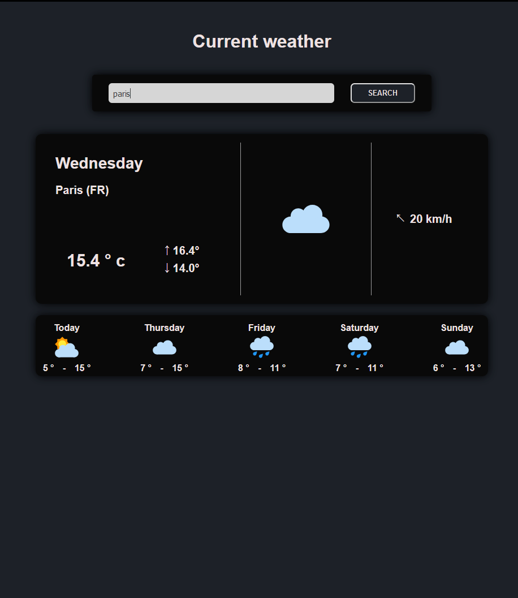

# React weather-app 
---

Une simple application météo créée avec le framework React.

## Objectives :
---

Ceci est ma deuxième application React et l'idée était avant tout de réaliser une application faisant appel à une vraie API externe et non plus locale. L'application peut :

- utiliser une API de données météo afin d'afficher les informations d'une ville en particulier,
- afficher les données météo pour le jour en cours (partie principale) et les 4 prochains jours (bandeau du dessous).

Pour lancer l'application il suffit de taper la commande "npm start".

## Technologies used :
---

- HTML
- CSS
- Javascript
- React framework (react, react-dom)
- Axios (API : openWeatherMap.org)

